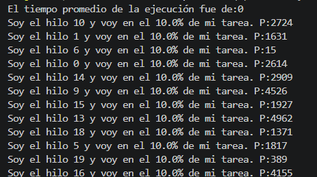
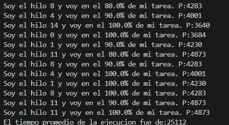

# Taller de sincronizacion por barrera

## Descripcion

Este proyecto corresponde al ejercicio de sincronizacion por barrera. El programa crea varios hilos que realizan una tarea con tiempos de espera diferentes. Al final se debe calcular el promedio de los tiempos de ejecucion de todos los hilos.

En la version inicial, el programa principal lanzaba los hilos y calculaba el promedio inmediatamente. Por eso el resultado podia salir en `0` o en un valor incorrecto, ya que los hilos todavia no habian terminado de ejecutar su tarea.

## Instrucciones del laboratorio

1. Descargar e importar el proyecto `BarrierSyncProblem.zip`.
2. Revisar el programa principal. Este ejemplo hace uso de N hilos que realizan una misma tarea a una velocidad diferente. El objetivo del programa es ejecutar los N hilos y, una vez hayan terminado, promediar el tiempo de ejecucion de todos estos.
3. Ejecutar el programa y revisar el mensaje: `El tiempo promedio de la ejecucion fue de:...`. Analizar si el resultado obtenido es correcto y por que se da ese resultado.
4. Aplicar una estrategia de sincronizacion por barrera, de manera que el calculo del promedio de los tiempos de ejecucion se realice solo cuando el ultimo hilo haya terminado. Es decir, el programa principal debe dormirse mientras los hilos se ejecutan y solo despertarse cuando el ultimo haya terminado.
5. Verificar que el funcionamiento sea el esperado.

## Cambios realizados

### Clase `Main`

Se agrego un `CountDownLatch` llamado `barreraFinalizacion`, inicializado con el numero total de hilos:

```java
CountDownLatch barreraFinalizacion=new CountDownLatch(numHilos);
```

Este objeto funciona como una barrera: el hilo principal espera hasta que todos los hilos de trabajo reporten que terminaron.

Tambien se cambio la creacion de los hilos para pasarles la barrera:

```java
hilos[i]=new HiloProc(i, barreraFinalizacion);
```

Despues de iniciar todos los hilos, el programa principal queda esperando con:

```java
barreraFinalizacion.await();
```

Solo despues de eso se calcula el promedio de los tiempos. De esta forma, los valores de `resultado` ya estan completos.

### Clase `HiloProc`

Se agrego el atributo:

```java
private final CountDownLatch barreraFinalizacion;
```

El constructor ahora recibe la barrera y la guarda:

```java
public HiloProc(int id, CountDownLatch barreraFinalizacion)
```

Al final del metodo `run()`, cada hilo llama:

```java
barreraFinalizacion.countDown();
```

Esto indica que ese hilo ya termino. Se puso dentro de un bloque `finally` para asegurar que la barrera se actualice incluso si ocurre un problema durante la ejecucion del hilo.

## Que problema se resolvio

Antes, el hilo principal no esperaba a los demas hilos. Por eso podia calcular el promedio antes de que existieran resultados reales.

Con la barrera, el flujo queda asi:

1. Se crean los 20 hilos.
2. Se inician los 20 hilos.
3. El hilo principal se bloquea en `await()`.
4. Cada hilo termina su tarea y hace `countDown()`.
5. Cuando el ultimo hilo termina, el hilo principal continua.
6. Se calcula e imprime el promedio correcto.

## Verificacion

Comandos usados para compilar y ejecutar:

```powershell
javac -d bin src\edu\eci\arsw\samples\Main.java src\edu\eci\arsw\samples\HiloProc.java
java -cp bin edu.eci.arsw.samples.Main
```

El comportamiento esperado es que el mensaje:

```text
El tiempo promedio de la ejecucion fue de:...
```

aparezca solo despues de que todos los hilos hayan llegado al `100%`.

## Evidencias

### Ejecucion de la primera version




El promedio se calcula antes de que los hilos terminen, por eso el resultado no representa los tiempos reales de ejecucion.

### Ejecucion de la version corregida




El promedio aparece al final, despues de que todos los hilos terminan su tarea.
